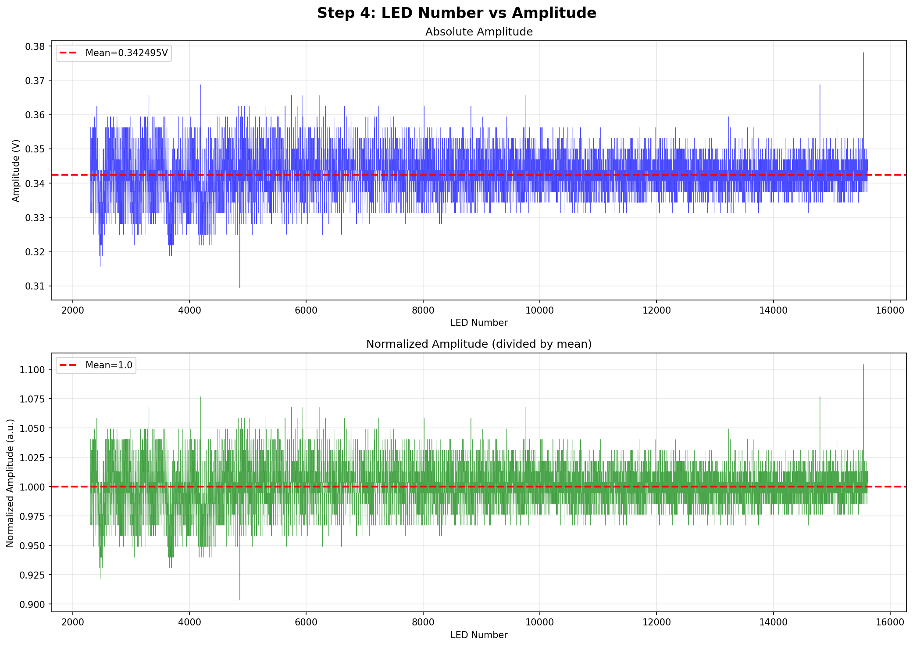
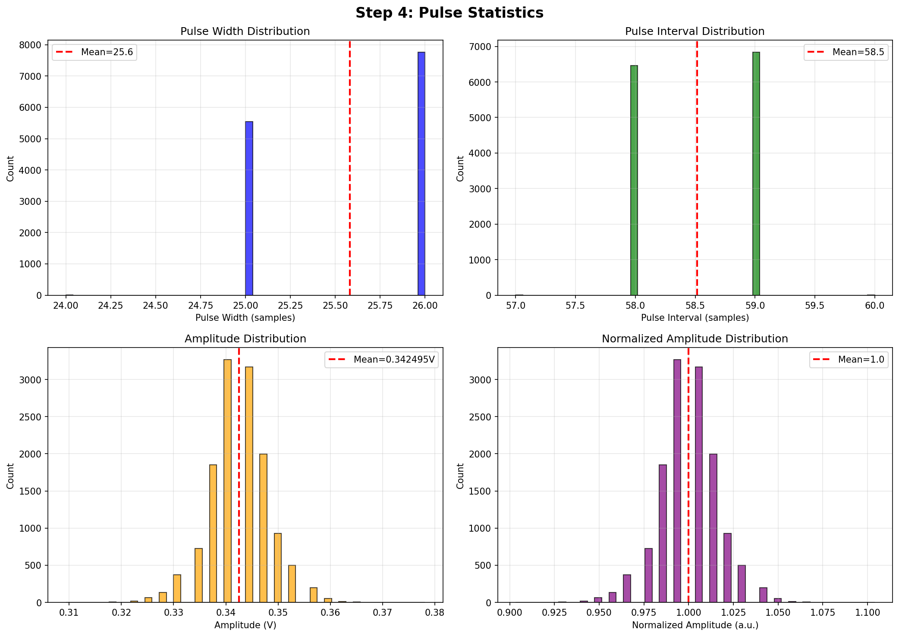
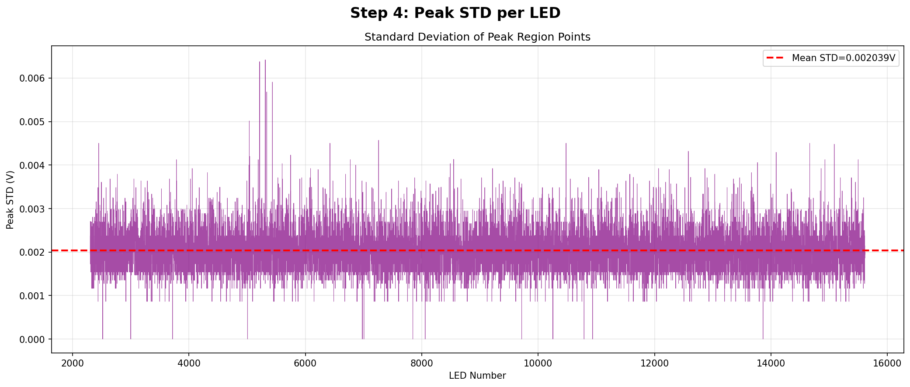

# LED Power Analyzer

**A comprehensive Python tool for analyzing LED power measurement data from binary oscilloscope/power meter recordings.**

[](https://www.python.org/downloads/)
[](https://opensource.org/licenses/MIT)

##  Overview

This analyzer processes binary voltage data files (`.bin`) captured from power meters during LED module testing. It automatically detects individual LED pulses, calculates their characteristics (amplitude, width, interval), identifies anomalies, and generates comprehensive visualization reports and CSV exports.

**Key Capabilities:**
-  Automatic pulse detection and threshold calculation
-  Statistical analysis of 13,000+ LED pulses in seconds
-  Anomaly detection using 3-sigma statistical thresholds
-  Professional visualization with multiple analysis graphs
-  CSV export with detailed per-LED measurements
-  Optimized for large datasets (900K+ samples)
-  Pre-configured for multiple LED module types

##  Use Cases

- **Quality Control**: Automated LED brightness uniformity testing
- **Manufacturing**: High-throughput LED module validation
- **R&D**: LED performance characterization and analysis
- **Failure Analysis**: Identifying defective LEDs in production batches

##  Sample Output

### LED Amplitude Distribution

*Top: Absolute amplitude per LED | Bottom: Normalized amplitude showing uniformity*

### Statistical Analysis

*Pulse width, interval, and amplitude distributions with mean values*

### Peak Standard Deviation

*Standard deviation of peak region points - useful for signal quality assessment*

##  Quick Start

### Prerequisites
```python
# Required Python 3.12+
pip install numpy scipy matplotlib
```

### Basic Usage
```python
# Analyze with pre-configured module
python led_reader_test.py measurement.bin Rear

# Or specify custom LED range
python led_reader_test.py measurement.bin 2304 15615
```

### Example Analysis Session
```
 Selected Module: Rear (ID: 0)
 LED Range: 2304 - 15615 (13,312 LEDs expected)

 Voltage Data Analysis:
Values count: 925,601
Range: -0.146250V to 0.238125V

 STEP 4: PRECISE PULSE DETECTION
  Expected LEDs: 13,312
  Detected pulses: 13,312
   Perfect match!

 Anomaly Report (>3σ):
  Total anomalies found: 236
   Amplitude anomalies: 114
   Peak STD anomalies: 106

 CSV exported: measurement_analyzed.csv
 Total analysis completed in 27.81 seconds
```

##  Analysis Pipeline

### Step 1: Histogram Analysis & Threshold Detection
- Analyzes voltage distribution across entire dataset
- Identifies peak and valley clusters automatically
- Calculates optimal threshold (midpoint between clusters)

### Step 2: Initial Pulse Detection
- Detects threshold crossings (rising/falling edges)
- Validates pulse consistency
- Calculates average pulse characteristics

### Step 3: Dead Zone Removal
- Uses sliding window STD analysis
- Removes low-signal regions from start/end of recording
- Applies 25% STD threshold with safety margins
- Retains ~85% of active measurement data

### Step 4: Precise Pulse Analysis
- **Peak Calculation**: Mean of central 50% of pulse
- **Valley Calculation**: Minimum between pulses
- **Amplitude**: Peak - Valley for each LED
- **Peak STD**: Standard deviation within peak region
- Generates statistical histograms and per-LED plots

### Step 5: Anomaly Detection
Identifies LEDs with >3σ deviation in:
- **Amplitude**: Brightness variations
- **Pulse Width**: Timing irregularities
- **Interval**: Spacing anomalies
- **Peak STD**: Signal quality issues

##  Output Files

All outputs are saved to `{filename}_analysis/` directory:

| File | Description |
|------|-------------|
| `step4_statistics_histograms.png` | Pulse width, interval, and amplitude distributions |
| `step4_led_vs_amplitude.png` | Per-LED amplitude plot (absolute & normalized) |
| `step4_peak_std.png` | Standard deviation per LED |
| `{filename}_analyzed.csv` | Complete data with anomaly flags |

### CSV Format
```csv
LED_Number,Peak_V,Valley_V,Amplitude_V,Peak_STD_V,Pulse_Width_samples,Interval_samples,Amplitude_Anomaly,Width_Anomaly,STD_Anomaly
2304,0.221875,-0.128125,0.350000,0.001967,26,58,NO,NO,NO
2305,0.225000,-0.128125,0.353125,0.002079,26,59,NO,NO,NO
...
```

##  Module Configuration

Pre-configured for three LED module types:

```python
CROSSTALK_CONFIG = [
    {
        "name": "Rear",
        "module_id": 0,
        "first_led": 2304,
        "last_led": 15615,
        "expected_leds": 13312,
    },
    {
        "name": "Middle",
        "module_id": 1,
        "first_led": 256,
        "last_led": 15615,
        "expected_leds": 15360,
    },
    {
        "name": "Front",
        "module_id": 2,
        "first_led": 256,
        "last_led": 21247,
        "expected_leds": 20992,
    },
]
```

### Usage Examples
```bash
# By module name
python led_reader_test.py data.bin Rear

# By module ID
python led_reader_test.py data.bin 0

# Custom range
python led_reader_test.py data.bin 256 21247
```

##  Technical Details

### Binary File Format
- **Header**: 128 bytes (skipped)
- **Data**: 32-bit float array (little-endian)
- **Units**: Voltage (V)

### Performance Optimizations
- Downsampling for visualization (5K-10K points)
- Vectorized numpy operations
- Smart window-based STD calculations
- Parallel-ready architecture

### Algorithm Features
- **Adaptive thresholding**: Histogram-based clustering
- **Robust peak detection**: 50% central region averaging
- **Statistical anomaly detection**: 3-sigma threshold
- **Dead zone removal**: STD-based boundary detection

##  Typical Results

**Example: Spark Rear Module (W3)**
- File size: 3.7 MB (925,601 samples)
- LEDs detected: 13,312 / 13,312 (100% match)
- Processing time: ~28 seconds
- Anomalies found: 236 (1.8%)
  - Amplitude: 114 LEDs
  - Peak STD: 106 LEDs
  - Pulse width: 14 LEDs
  - Interval: 2 LEDs

##  Development

### Project Structure
```
led-signal-analyzer/
 led_reader_test.py      # Main analyzer script (2070 lines)
 examples/                # Sample output images
 .gitignore              # Excludes outputs and data files
 README.md               # This file
```

### Contributing
This is a professional analysis tool developed for LED manufacturing QC. For questions or collaboration opportunities, please reach out.

##  License

MIT License - See LICENSE file for details

##  Author

**Tsahi Geller**
- Hardware/Software Engineer
- Specializing in LED characterization and test automation
- GitHub: [@ItzhakGeller](https://github.com/ItzhakGeller)

---

*Developed for high-precision LED module quality control and characterization*
