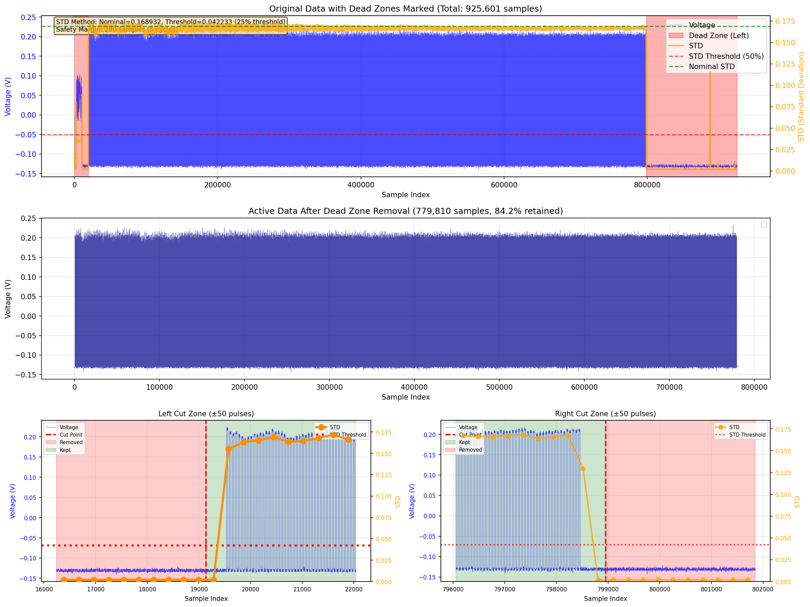
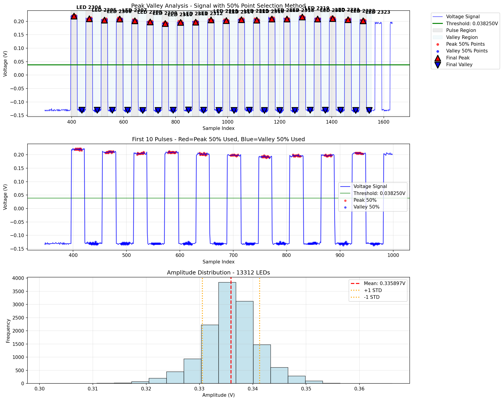

# LED Power Analyzer

**A comprehensive Python tool for analyzing LED power measurement data from binary oscilloscope/power meter recordings.**

##  Overview

This analyzer processes binary voltage data files (`.bin`) captured from power meters during LED module testing. It automatically detects individual LED pulses, calculates their characteristics (amplitude, width, interval), identifies anomalies, and generates comprehensive visualization reports and CSV exports.

**Key Capabilities:**
-  Automatic pulse detection and threshold calculation
-  Statistical analysis of 13,000+ LED pulses in seconds
-  Anomaly detection using 3-sigma statistical thresholds
-  Professional visualization with multiple analysis graphs
-  CSV export with detailed per-LED measurements
-  Optimized for large datasets (900K+ samples)
-  Pre-configured for multiple LED module types

##  Use Cases

- **Quality Control**: Automated LED brightness uniformity testing
- **Manufacturing**: High-throughput LED module validation
- **R&D**: LED performance characterization and analysis
- **Failure Analysis**: Identifying defective LEDs in production batches

---

##  Analysis Process Visualization

### Step 3: Dead Zone Removal & Signal Cleanup

**What this shows:**
- **Top graph**: Raw signal with STD (Standard Deviation) overlay showing signal quality across the measurement
  - Blue line: Voltage signal from power meter
  - Orange line: STD calculated in sliding windows
  - Red areas: Dead zones (low signal quality) identified and removed
  - Green areas: Active measurement regions retained
  
**How it works:**
1. Calculate STD in 5-pulse-cycle windows across entire dataset
2. Find nominal STD at center of recording (highest quality)
3. Set threshold at 25% of nominal STD
4. Scan bidirectionally from center to find boundaries where STD drops below threshold
5. Remove dead zones while keeping 5-cycle safety margin

**Result:** ~85% of data retained, removing only noisy start/end regions

---

### Step 4: Statistical Analysis

**What this shows:**
Four key distributions after pulse detection:
1. **Pulse Width**: Consistency of LED pulse duration (typically ~26 samples)
2. **Pulse Interval**: Spacing between consecutive LEDs (typically ~59 samples)
3. **Amplitude (Absolute)**: Raw peak-to-valley voltage for each LED
4. **Amplitude (Normalized)**: Relative brightness (divided by mean)

**How it works:**
- Red dashed line shows mean value
- Tight distributions indicate good measurement quality
- Outliers visible as histogram tails help identify defective LEDs

---

### Step 4: Per-LED Amplitude Analysis

**What this shows:**
- **Top graph**: Absolute amplitude (voltage) for each of 13,312 LEDs
- **Bottom graph**: Normalized amplitude showing relative brightness variations

**How threshold is calculated:**
1. Create histogram of all voltage values
2. Identify two main peaks (HIGH = LED on, LOW = LED off)
3. Set threshold exactly midway between peaks
4. Example: Peak at 0.205V, Valley at -0.129V  Threshold = 0.038V

**What to look for:**
- Gradual trends indicate thermal effects or power supply drift
- Sharp drops indicate defective LEDs
- Tight clustering around mean = good uniformity

---

### Step 4: Peak Standard Deviation

**What this shows:**
Standard deviation of voltage values within each LED's peak region (central 50% of pulse)

**Why it matters:**
- Low STD = stable, clean signal
- High STD = noisy signal or flickering LED
- Sudden spikes indicate measurement issues or LED instability

---

### Step 5: Peak & Valley Extraction Method

**What this shows (3 panels):**

**Top Panel**: Overview of signal processing
- Blue signal with detected pulses
- Green threshold line
- Red shaded = Peak regions (central 50% of each pulse used for averaging)
- Blue shaded = Valley regions (50% between pulses used for minimum detection)

**Middle Panel**: Detailed view of 10 pulses
- Shows exactly which points are used for peak/valley calculation
- Red dots = Points averaged for peak value
- Blue dots = Points used for valley minimum
- Demonstrates the 50% central region selection method

**Bottom Panel**: Amplitude distribution histogram
- Shows consistency of LED brightness across all 13,312 LEDs
- Mean amplitude with 1σ bands

**How Peak & Valley are extracted:**

\\\
For each LED pulse:
 PEAK: 
   Find pulse boundaries (threshold crossings)
   Calculate pulse center
   Take central 50% of pulse (25% each side of center)
   Average voltage in this region = PEAK value

 VALLEY:
    Region between current pulse end and next pulse start
    Take central 50% of gap region
    Find minimum voltage = VALLEY value

AMPLITUDE = PEAK - VALLEY
\\\

**Why 50% central region?**
- Eliminates edge effects from threshold crossings
- Reduces noise from rise/fall transitions
- Provides stable, repeatable measurements

---

##  Quick Start

### Prerequisites
\\\python
# Required Python 3.12+
pip install numpy scipy matplotlib
\\\

### Basic Usage
\\\python
# Analyze with pre-configured module
python led_reader_test.py measurement.bin Rear

# Or specify custom LED range
python led_reader_test.py measurement.bin 2304 15615
\\\

### Example Analysis Session
\\\
 Selected Module: Rear (ID: 0)
 LED Range: 2304 - 15615 (13,312 LEDs expected)

 Voltage Data Analysis:
Values count: 925,601
Range: -0.146250V to 0.238125V

 STEP 4: PRECISE PULSE DETECTION
  Expected LEDs: 13,312
  Detected pulses: 13,312
   Perfect match!

 Anomaly Report (>3σ):
  Total anomalies found: 236
   Amplitude anomalies: 114
   Peak STD anomalies: 106

 CSV exported: measurement_analyzed.csv
 Total analysis completed in 27.81 seconds
\\\

---

##  Analysis Pipeline Details

### Step 1: Histogram Analysis & Threshold Detection
**Purpose:** Automatically find optimal threshold to distinguish LED ON vs OFF states

**Method:**
1. Create histogram of all voltage values in dataset
2. Identify two highest peaks (bimodal distribution)
   - Higher voltage peak = LED ON state
   - Lower voltage peak = LED OFF state
3. Calculate threshold = (HIGH_PEAK + LOW_PEAK) / 2

**Example:**
- Peak voltage: 0.205V (LED on)
- Valley voltage: -0.129V (LED off)  
- **Threshold: 0.038V** 

### Step 2: Initial Pulse Detection
**Purpose:** Find all threshold crossings and validate pulse pattern

**Method:**
1. Detect rising edges (voltage crosses threshold upward)
2. Detect falling edges (voltage crosses threshold downward)
3. Validate consistency (every rise followed by fall)
4. Calculate average pulse width and interval

**Output:**
- Pulse width: ~26 samples
- Pulse interval: ~59 samples
- Total cycle: ~85 samples per LED

### Step 3: Dead Zone Removal
**Purpose:** Remove noisy regions from start/end of recording

**Method:**
1. Calculate STD in sliding windows (5 pulse cycles each)
2. Find nominal STD at center (cleanest signal)
3. Set threshold at 25% of nominal STD
4. Scan left/right from center until STD drops below threshold
5. Remove dead zones with 5-cycle safety margin

**Result:** Typically retains ~85% of data, removes ~15% dead zones

### Step 4: Precise Pulse Analysis
**Purpose:** Extract exact peak, valley, and amplitude for each LED

**Peak Calculation:**
- Find pulse boundaries (threshold crossings)
- Take central 50% of pulse region
- Calculate **mean** of voltages in this region

**Valley Calculation:**
- Region between current pulse and next pulse
- Take central 50% of gap
- Find **minimum** voltage in this region

**Amplitude:** PEAK - VALLEY for each LED

**Statistics Generated:**
- Per-LED amplitude (absolute and normalized)
- Pulse width distribution
- Interval distribution  
- Peak STD (signal quality metric)

### Step 5: Anomaly Detection
**Purpose:** Identify LEDs with abnormal characteristics

**Method:** 3-sigma statistical threshold
- Calculate mean and STD for each metric
- Flag any LED with deviation > 3σ

**Anomaly Types:**
1. **Amplitude Anomalies**: Brightness too high/low
2. **Pulse Width Anomalies**: Duration unusual
3. **Interval Anomalies**: Spacing irregular
4. **Peak STD Anomalies**: Noisy or unstable signal

---

##  Output Files

All outputs saved to \\{filename}_analysis/\\ directory:

| File | Description |
|------|-------------|
| \\step3_dead_zone_removal.png\\ | Signal cleanup visualization with STD analysis |
| \\step4_statistics_histograms.png\\ | Pulse width, interval, and amplitude distributions |
| \\step4_led_vs_amplitude.png\\ | Per-LED amplitude plot (absolute & normalized) |
| \\step4_peak_std.png\\ | Standard deviation per LED |
| \\step5_peak_valley_extraction.png\\ | Peak/valley extraction method demonstration |
| \\{filename}_analyzed.csv\\ | Complete data with anomaly flags |

### CSV Format
\\\csv
LED_Number,Peak_V,Valley_V,Amplitude_V,Peak_STD_V,Pulse_Width_samples,Interval_samples,Amplitude_Anomaly,Width_Anomaly,STD_Anomaly
2304,0.221875,-0.128125,0.350000,0.001967,26,58,NO,NO,NO
2305,0.225000,-0.128125,0.353125,0.002079,26,59,NO,NO,NO
...
\\\

---

##  Module Configuration

Pre-configured for three LED module types:

\\\python
CROSSTALK_CONFIG = [
    {
        "name": "Rear",
        "module_id": 0,
        "first_led": 2304,
        "last_led": 15615,
        "expected_leds": 13312,
    },
    {
        "name": "Middle",
        "module_id": 1,
        "first_led": 256,
        "last_led": 15615,
        "expected_leds": 15360,
    },
    {
        "name": "Front",
        "module_id": 2,
        "first_led": 256,
        "last_led": 21247,
        "expected_leds": 20992,
    },
]
\\\

### Usage Examples
\\\ash
# By module name
python led_reader_test.py data.bin Rear

# By module ID
python led_reader_test.py data.bin 0

# Custom range
python led_reader_test.py data.bin 256 21247
\\\

---

##  Technical Details

### Binary File Format
- **Header**: 128 bytes (skipped)
- **Data**: 32-bit float array (little-endian)
- **Units**: Voltage (V)

### Performance Optimizations
- Downsampling for visualization (5K-10K points)
- Vectorized numpy operations
- Smart window-based STD calculations
- Parallel-ready architecture

### Algorithm Features
- **Adaptive thresholding**: Histogram-based clustering
- **Robust peak detection**: 50% central region averaging
- **Statistical anomaly detection**: 3-sigma threshold
- **Dead zone removal**: STD-based boundary detection

---

##  Typical Results

**Example: Spark Rear Module (W3)**
- File size: 3.7 MB (925,601 samples)
- LEDs detected: 13,312 / 13,312 (100% match)
- Processing time: ~28 seconds
- Dead zones removed: 15% (start/end noise)
- Anomalies found: 236 (1.8%)
  - Amplitude: 114 LEDs
  - Peak STD: 106 LEDs
  - Pulse width: 14 LEDs
  - Interval: 2 LEDs

**Signal Quality Metrics:**
- Mean amplitude: 0.343V
- Amplitude STD: 0.006V (1.6% variation)
- Pulse width: 26  0.5 samples
- Interval: 59  0.5 samples

---

##  Development

### Project Structure
\\\
led-signal-analyzer/
 led_reader_test.py      # Main analyzer script (2070 lines)
 examples/                # Sample output images
    step3_dead_zone_removal.png
    step4_statistics_histograms.png
    step4_led_vs_amplitude.png
    step4_peak_std.png
    step5_peak_valley_extraction.png
 .gitignore              # Excludes outputs and data files
 README.md               # This file
\\\

### Contributing
This is a professional analysis tool developed for LED manufacturing QC. For questions or collaboration opportunities, please reach out.

---

##  License

MIT License - See LICENSE file for details

---

##  Author

**Tsahi Geller**
- Hardware/Software Engineer
- Specializing in LED characterization and test automation
- GitHub: [@ItzhakGeller](https://github.com/ItzhakGeller)

---

*Developed for high-precision LED module quality control and characterization*
